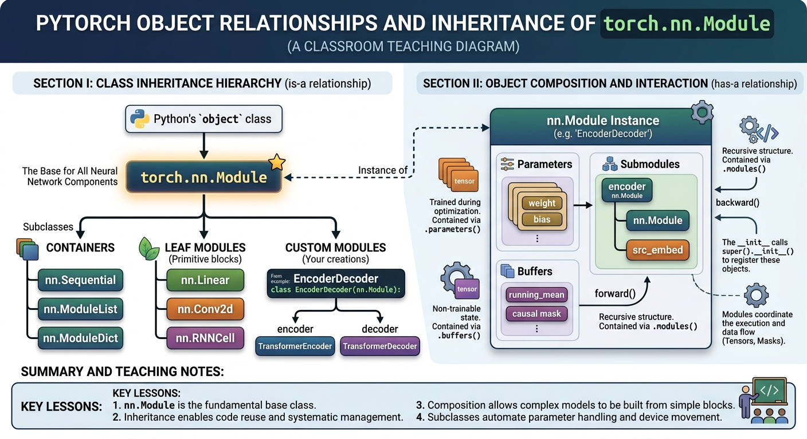

# Introduction to PyTorch (teaching)


# PyTorch Basics Tutorial

A beginner-friendly introduction to PyTorch fundamentals.

## 📚 What You'll Learn

This repository contains simple, well-commented examples covering:

1. **Tensors** - The fundamental data structure in PyTorch
2. **Autograd** - Automatic differentiation for computing gradients
3. **Linear Regression** - Building your first model
4. **Neural Network** - Creating a simple neural network

## 🚀 Getting Started

### Prerequisites

- Python 3.8 or higher
- Basic understanding of Python

### Installation

1. Clone this repository:
```bash
git clone https://github.com/neelsoumya/teaching_intro_pytorch.git
cd teaching_intro_pytorch
```

2. Install dependencies:
```bash

python -m venv venv_pytorch
source venv_pytorch/bin/activate  # On Windows use `venv_pytorch\Scripts\activate`
pip install -r requirements.txt
```

## 📖 Tutorial Structure

- [PyTorch basics and backward and forward pass and class structure](pytorch_forward_backward_explained.md)




- Minimal example in `PyTorch`

```python

# Python script to build a neural network using PyTorch for educational purposes.

#This script demonstrates the basics of defining a neural network, training it on a simple dataset, and evaluating its performance.

#Requirements:
#- Python 3.x
#- PyTorch
#- NumPy

#Usage:
#1. Install Python 3.x from https://www.python.org/downloads/
#2. Install PyTorch by following instructions at https://pytorch.org/get-started/locally/
#2. Create a virtual environment (optional but recommended):
#   python -m venv venv_pytorch
#   source venv_pytorch/bin/activate  # On Windows use `venv_pytorch\Scripts\activate`
#   pip install -r requirements.txt

#Usage:
#    python 03_nn.py

#Acknowledgements:
#- Based on PyTorch tutorials and documentation.
#- https://www.coursera.org/learn/pytorch-fundamentals/ungradedLab/chHVv/modeling-non-linear-patterns-with-activation-functions


# Load libraries
import torch # Main PyTorch library
import torch.nn as nn # For neural network modules
import torch.optim as optim # For optimization algorithms
import numpy as np # For numerical operations


# distances for delivery
distances = torch.tensor([  [1.0] , 
                          [2.0] , 
                          [3.0] , 
                          [4.0] , 
                          [5.0] , 
                          [6.0] , 
                          [7.0] 
                          ],
                          dtype = torch.float32
                        )

# delivery times
times = torch.tensor([  [1.5] , 
                       [1.7] , 
                       [3.2] , 
                       [3.8] , 
                       [5.1] , 
                       [5.3] , 
                       [7.2] 
                       ],
                       dtype = torch.float32
                     )

print(" Building a simple neural network model to predict delivery time based on distance \n ")

# define the neural network model
model = nn.Sequential(
    nn.Linear(1,1) # One input feature (distance), one output feature (time)
)

# define the loss function and optimizer
loss_function = nn.MSELoss() # Mean Squared Error loss
optimizer = optim.SGD(
    model.parameters(), # Stochastic Gradient Descent optimizer
    lr = 0.01          # Learning rate
)

print("Starting training...\n")

# train the model
num_epochs = 1000
for epoch in range(num_epochs): # Training loop
    optimizer.zero_grad()      # Zero the gradients
    outputs = model(distances) # Forward pass
    loss = loss_function(outputs, times) # Compute loss
    loss.backward()            # Backward pass
    optimizer.step()           # Update weights
    #print("Epoch", epoch + 1, "\n")
    #print("Loss:", loss.item(), "\n")

# plot loss over epochs
import matplotlib.pyplot as plt
#plt.figure()
#plt.plot( range(num_epochs),
#         [loss_function()])

print("\n Make predictions using a simple model \n")
# plot the prediction of the model with the actual data
predicted = model(distances).detach().cpu() # Get predictions
# what is detach() doing here?
# It detaches the tensor from the computation graph, so that no gradients are tracked for it.
# detach() returns a new tensor that shares the same storage but is detached from PyTorch's autograd graph — so operations on it won't be tracked for gradients. 
# Use it before converting to NumPy or lists to avoid autograd errors.

try:
    predicted = model(distances).detach().cpu().numpy() # Get predictions as NumPy array
    distances_plot = distances.cpu().numpy()
    times_plot = times.cpu().numpy() 
except:
    predicted = model(distances).detach().cpu().tolist() # Fallback to list if NumPy conversion fails
    distances_plot = distances.cpu().tolist()
    times_plot = times.cpu().tolist()
    
plt.figure()
plt.plot(distances_plot,
         times_plot,
         'ro',
         label = 'Original data'
         )
plt.plot(distances_plot,
         predicted,
         label = 'Model prediction'
        )
plt.xlabel("Distance")
plt.ylabel("Delivery time")
plt.title("Simple model Predictions vs Original Data")
plt.legend()
plt.show()

```

- Then run the scripts in order:

### 1. Tensors (`01_tensors.py`)
Learn about PyTorch tensors - the building blocks of deep learning. Basics of tensor creation, manipulation, and operations.
```bash
python 01_tensors.py
```

### 2. Autograd (`02_autograd.py`)
Understand automatic differentiation and how PyTorch computes gradients.
```bash
python 02_autograd.py
```

### 3. Neural Networks (`03_nn.py`)
Build and train a simple neural network using PyTorch.
```bash
python 03_nn.py
```

### 3. Linear Regression (`03_linear_regression.py`)
Build a simple linear regression model from scratch.
```bash
python 03_linear_regression.py
```

### 4. Neural Network (`04_neural_network.py`)
Create and train a basic neural network for classification.
```bash
python 04_neural_network.py
```


## 📚 Additional Resources

- [PyTorch Official Documentation](https://pytorch.org/docs/stable/index.html)
- [PyTorch Tutorials](https://pytorch.org/tutorials/)
- [Deep Learning with PyTorch Book](https://pytorch.org/assets/deep-learning/Deep-Learning-with-PyTorch.pdf)


## 📄 License

GNU GPL License - feel free to use this for learning and teaching purposes.
